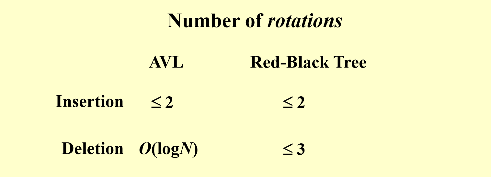
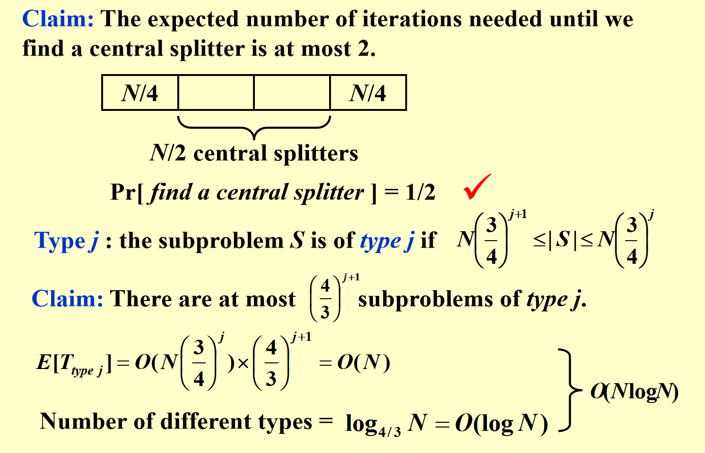

# ADS Notes

基本上内容都在PPT里了，PPT很重要。

## 1. AVL Trees, Splay Trees, and Amortized Analysis

### AVL

#### 平衡调整

LL和RR：旋转B节点一次到根


_注意RR Rotation指的是trouble maker在根节点右儿子的右儿子_

LR和RL：旋转C节点两次到根


给出一个我的代码实现：

```cpp
Node* balance(Node* node) {
    if (!node) return node;
    int bf = getBF(node);
    if (bf < -1) {
        if (getBF(node->right) > 0) {
            node->right = rotateRight(node->right);
        }
        return rotateLeft(node);
    }
    else if (bf > 1) {
        if (getBF(node->left) < 0) {
            node->left = rotateLeft(node->left);
        }
        return rotateRight(node);
    }
    return node;
}

Node* insert(Node* node, int key) {
    if (!node) return createNode(key);
    if (key < node->key) {
        node->left = insert(node->left, key);
    }
    else {
        node->right = insert(node->right, key);
    }
    updateHeight(node);
    return balance(node);
}
```

虽然上述代码中，为了写起来方便，对路径上每个节点都检查了一下BF。事实上，观察到四种旋转前后，以失衡节点为根的子树的高度都没有变化，因此至多进行一次调整，也就是说旋转次数至多为两次。

#### 删除

删除节点后调整需要的旋转次数是$O(\log{n})$的，具体删除方法没讲。

#### 树高和节点数的关系

设高度为$h$的AVL树最少有$n_h$个节点（定义空节点高度为-1），则

$$\begin{aligned}
n_0 &= 1 \\
n_1 &= 2 \\
n_h &= n_{h-1} + n_{h-2} + 1
\end{aligned}$$

实际上，$n_h = F_{h+3} - 1 \approx \frac{1}{\sqrt{5}} \left( \frac{1 + \sqrt{5}}{2}\right) ^ {h+3} - 1$, 其中${F_n}$是斐波那契数列。$n_h$前几个值如下：

| $h$ | $n_h$ |
| --- | ----- |
| 0   | 1     |
| 1   | 2     |
| 2   | 4     |
| 3   | 7     |
| 4   | 12    |
| 5   | 20    |
| 6   | 33    |
| 7   | 54    |

$h = O(\log{n})$, 因此大部分树操作都是$O(h) = O(\log{n})$。

### Splay树

#### Splay操作

Splay树的思想就是每次插入或删除后将节点旋转到根，从而保证树的高度为$O(\log{n})$。但是这里的旋转需要是双旋：


1. 如果P是根了，也就是G不存在了，单旋一次X到根。
2. 否则
    - 如果X、P、G不在一条直线上，则连续旋转两次X到原本G的位置
    - 如果X、P、G在一条直线上，则先旋转一次P，再旋转一次X到原本G的位置。

每一次Splay到根，树高都会大致减半。

#### 插入

直接插入然后Splay新节点。

#### 删除


### 摊还分析

建议看PPT

### Splay树的摊还分析

势能函数：


The amortized time to splay a tree with root T at node X is at most $3(R(T)–R(X)) + 1 = O(\log N)$.

### 摊还分析例题

Consider the following buffer management problem. Initially the buffer size (the number of blocks) is one. Each block can accommodate exactly one item. As soon as a new item arrives, check if there is an available block. If yes, put the item into the block, induced a cost of one. Otherwise, the buffer size is doubled, and then the item is able to put into. Moreover, the old items have to  be moved into the new buffer so it costs $k+1$ to make this insertion, where $k$ is the number of old items. Clearly, if there are $N$ items, the worst-case cost for one insertion can be $\Omega (N)$.  To show that the average cost is $O(1)$, let us turn to the amortized analysis. To simplify the problem, assume that the buffer is full after all the $N$ items are placed. Which of the following potential functions works?

- A.The number of items currently in the buffer
- B.The opposite number of items currently in the buffer
- C.The number of available blocks currently in the buffer
- D.The opposite number of available blocks in the buffer


<details>
<summary>
答案
</summary>
D.

题解思路：一个个代入看$\hat{c}$是否是常数。

我的思路：先手模一下，发现摊还花费是2, 则一次不重新分配空间的插入credit是+1，重新分配的插入credit是-k。求前缀和可以得到势能函数，发现刚好等于剩余空间的相反数。


</details>

## 2. Red-Black Trees and B+ Trees

### 红黑树

红黑树插入删除部分PPT内容很乱，建议结合这个B站视频理解，视频使用234树来讲解红黑树的操作，容易理解。视频链接：

[【neko算法课】红黑树 插入](https://www.bilibili.com/video/BV1BB4y1X7u3)
[【neko算法课】红黑树 删除](https://www.bilibili.com/video/BV1Ce4y1Q76H)

#### 定义


余下的证明：

任何一个到叶子节点的路径上，红色节点有$h(x) - bh(x)$个，黑色节点有$bh(x)$个，则红色节点不多于黑色节点$h(x) - bh(x) <= bh(x)$，因为不会有两个相邻的红色节点，且叶节点必为黑色。
。
例题：The following binary search tree is a valid red-black tree.


- T
- F

<details>
<summary>
答案
</summary>
T，不可能有红色节点只有一个非NIL子节点，违背定义5。
</details>

#### 插入

插入节点为红，有可能需要双红修正。

Case 1对应234树的上溢，需要递归维护。Case 2对应LR/RL情况，转化成Case 3即可。

先判断叔节点颜色：
- 红 -> Case 1，记得递归维护祖父节点
- 黑：再判断插入节点相对祖父位置
  - LR/RL -> 就是AVL的LR/RL，双旋
  - LL/RR -> 就是AVL的LL/RR，单旋

Case 2转成Case 3处理，一次旋转

Case 3仅需一次单旋


#### 删除


删除：
- 子节点都为NIL的节点：直接删，删红的无需维护，删黑的需要保持红黑树黑高一致性质，见下面删除后的调整。
- 有一个子节点非NIL：用这个子节点替换自己，这个子节点一定为红，替换被删节点原来的位置以后变成黑色，观察发现这种情况无需再调整了。
- 两个子节点都非NIL：与前驱或后继换位后，再删除自己（前驱或后继必定有NIL的子节点，不会递归），转化成了前两种情况。

综上我们只需要考虑一种情况，即删除一个黑色的、两个子节点都为NIL的节点。

删除后的调整：**维护被删节点x，使得它多出来一个黑高。**

PPT上这部分的情况很多很乱，我们根据neko算法课的内容整理：

1. 被删节点为根：直接删除
2. 被删节点的兄弟节点为黑色
    - 兄弟节点有红色子节点 -> 借用兄弟子节点修复
      - 红色侄子在远端：Case 4
      - 红色侄子在近端：Case 3
    - 兄弟节点无红色子节点 -> 父节点向下合并：Case 2
3. 被删节点的兄弟节点为红色 -> 转为黑色处理：Case 1

首先是Case 4，其实就是AVL树的RR单旋，把红色节点提上来的同时，x向下，黑高+1。因为我们只能提高红色节点，否则会影响其他的黑高。同时注意染色。这种情况无需递归修复。


Case 3可以转化成Case 4，但是也有更简单的想法，就是用一次AVL树的RL双旋，使得红色节点提高的同时，x降低，从而实现黑高+1。同样要注意染色。这种情况也无需递归修复。


当兄弟节点无红色子节点时，这是Case 2，只能借助父节点向下合并。
- 当父节点为红色时，直接将父节点与兄弟节点交换颜色即可，无需递归修复。
- 当父节点为黑色时，将兄弟节点染红，之后，兄弟节点的这个子树上面也黑高-1了，和x的子树一样，因此只需递归修复父节点，使得父节点黑高+1即可。


当兄弟节点为红色时，进行一次单旋转，转化成兄弟节点为黑，如何旋转和染色可以从234树的角度去看。


### AVL和红黑树插入和删除旋转的次数



例题：In the worst case the DELETE operation in a RED-BLACK tree of $n$ nodes requires $\Omega (\log n)$ rotations.
- T
- F

<details>
<summary>
答案
</summary>
F，红黑树删除至多需要三次旋转。
</details>

### B+树

#### 定义


要注意，在ADS这门课中，2-3树和2-3-4树特指3阶B+树和4阶B+树。而其他大部分资料里一般都是指3阶B树或4阶B树，在术语的使用上与课内有所不同。

#### 插入

插入操作很简单，如果上溢了就分裂，左边$\lceil{m / 2} \rceil$，右边$\lfloor{m / 2} \rfloor$，提升中间的key插入上一层，有可能递归地上溢。

## 3. Inverted File Index

建议看PPT

## 4. Leftist Heaps and Skew Heaps

$$
Npl(x) = \begin{cases}
-1 & \text{if } x = NIL\\
min\{Npl(c) + 1,\; c \in children(x) \} & \text{otherwise}
\end{cases}
$$

### 左偏树

#### 定义

任意节点的左节点的Npl都大于等于右节点的Npl。

#### 性质

若一个左偏树的right path上面有$r$个节点，则这个左偏树至少有$2^r - 1$个节点。可以用数学归纳法证明。

#### 合并

只需要考虑合并，因为插入操作可以看作是合并一个只有一个节点的左偏树。


### Skew Heap

#### 摊还分析

定义Heavy node是右子树大小大于等于左子树大小的节点。


right path上面的节点才可能改变轻重（且重节点会全部变成轻节点），其他都不变，因此merge后势能$\leq l_1 + l_2 + h$。

right path上面轻节点的个数是$O(\log n)$的，因为在轻节点上每次往右走大小至少减半。

#### 例题

Merge the two skew heaps in the following figure.  Which one of the following statements is FALSE?


- A.15 is the right child of 8
- B.14 is the right child of 6
- C.1 is the root
- D.9 is the right child of 3

<details>
<summary>
答案
</summary>
A


注意最后6节点即使和空节点合并，也需要交换两个儿子。
</details>

## 5. Binomial Queue

binomial queue是一个二项堆的队列，或者说一个森林，$B_k$有$k$个儿子，$B_0, B_1, B_2, \cdots B_{k-1}$，$B_k$有$2^k个节点，深度为$d$的节点有$\binom{k}{d}$ 个。

可以通过转二进制的方法来计算某个大小的binomial queue有哪些高度的二项堆。

### 查找最小值

最小值一定是某个根，如果直接暴力查找，是$O(\log n)$，如果每次改变根维护一下最小值，是$O(1)$。

### 合并

单次$O(\log n)$，$n$次$O(n)$，均摊$O(1)$，比前面学过的其他堆的总时间$O(n \log n)$好。

$O(n)$证明：
1. 使用aggregate method，假设$n$是2的幂，每一步代价直接加起来
2. 使用势能法，势能函数为队列中树的个数。可以计算出摊还时间为2，因为代价$c$的插入会使得队列中树的个数变化$2-c$。

> If the smallest nonexistent binomial tree is $B_i$ , then $T_p = Const \cdot (i + 1)$

### 删除最小值

删除最小值需要合并剩下的数，和删除最小值之后多出来的子树，$O(\log n)$。

### 实现

使用左儿子右兄弟的表示法，在这种情况下，较大的儿子应该在**左边**，这样方便各种操作。

## 6. Backtracking

### Eight Queens

建议看PPT

### The Turnpike Reconstruction Problem

先看最远的距离是多少，把$x_1$和$x_n$放在头尾，然后从剩下的距离远到近使用回溯法排。

### 模版代码


### Tic-Tac-Toe

建议看PPT，这里使用了min-max树

### a-b 剪枝

父节点是取max的，且该节点大于等于某个侄子。


父节点是取min的，且该节点小于等于某个侄子。


a-b剪枝可以把搜索树的规模减到$O(\sqrt{n})$

## 7. Divide and Conquer

### 最近点对问题

暴力是$O(n^2)$的。使用分治法思想，把点集均分成两部分，分别求最近点对，合并的时候再加上跨越中线的点对。

$T(n) = 2T(\frac{n}{2}) + f(n)$，其中$f(n)$是合并的复杂度。假如我们暴力地遍历所有跨越中线的点对，$f(n) = n^2$，我们仍然会得到一个$O(N^2)$的算法。

但是有一种合并方法可以让我们线性时间内合并两个部分。


我们只考虑到中线距离小于$\delta$的点，然后从上到下扫描，每次只考虑一个$\delta$高，$2\delta$宽的矩形内的点对，这样复杂度就是$O(n)$。证明如下：


然后我们只需要把$\delta$取为左右区间最近点对的最小值，这样就能确保不会漏掉所有跨中线的点对。最终的复杂度是$O(n \log n)$。

### 主定理


建议做例题理解。

## 8. Dynamic Programming

建议看PPT

- 斐波那契数列
- 矩阵乘法最优顺序
- 最优二叉搜索树
- 全源最短路的Floyd算法
- 产品组装（DAG图上dp，如何记录和恢复最优解）

### How to design a DP method?

- Characterize an optimal solution
- Recursively define the optimal values
- Compute the values in some order
- Reconstruct the solving strategy

### Elements of DP

- Optimal substructure: 最优子结构
- Overlapping sub-problems: 重叠子问题

### 例题

The root of an optimal binary search tree always contains the key with the highest search probability. 

- T
- F

<details>
<summary>
答案
</summary>
F
</details>

## 9. Greedy Algorithms

建议看PPT

- Activity Selection Problem: 按照结束时间排序
- 哈弗曼编码：每次选择两个概率最低的合并

### 例题

Let S be the set of activities in Activity Selection Problem.  Then the earliest finish activity $a_m$ must be included in all the maximum-size subset of mutually compatible activities of S.  
- T
- F

<details>
<summary>
答案
</summary>
F，最优解不一定是贪婪解（但贪婪解一定是最优解）
</details>

---

Consider the problem of making change for $n$ cents using the fewest number of coins. Assume that each coin's value is an integer.The coins of the lowest denomination（面额） is the cent.

(I) Suppose that the available coins are quarters (25 cents), dimes (10 cents), nickels (5 cents), and pennies (1 cent). The greedy algorithm always yields an optimal solution.

(II) Suppose that the available coins are in the denominations that are powers of c, that is, the denominations are $c^0$, $c^1$, ..., $c^k$ for some integers $c>1$ and $k>=1$. The greedy algorithm always yields an optimal solution.

(III) Given any set of $k$ different coin denominations which includes a penny (1 cent) so that there is a solution for every value of $n$, greedy algorithm always yields an optimal solution.

Which of the following is correct?

- A.Statement (I) is false.

- B.Statement (II) is false.

- C.Statement (III) is false.

- D.All of the three statements are correct.


<details>
<summary>
答案
</summary>

C，反例$\{1, 3, 4\}$取$6$，最优解是$3+3$，贪婪解是$1+1+4$。
</details>

---

A binary tree that is not full cannot correspond to an optimal prefix code.

- T
- F

<details>
<summary>
答案
</summary>
T，考虑哈夫曼编码的过程。
</details>

## 10. NP-Completeness

不是NP：
- 欧拉回路
- 单源最短路

NP：Nondeterministic polynomial-time，指的是在非确定图灵机上能在多项式时间内解决的问题。
- Hamilton回路
- 旅行商问题
- 子集和问题
- 单源最长路

既不是P也不是NP：
- 停机问题，这是一个不可判定问题

NP完全问题：NP问题中最难的一类，所有NP问题都可被多项式归约到它。
- SAT
- Hamilton回路
- 旅行商问题
- clique problem
- vertex cover problem

### Formal language

建议看PPT

P:
- A language L is decided by an algorithm A if every binary string in L is accepted by A and every binary string not in L is rejected by A. 如果以上可以在多项式内完成，那么这个问题是P
- 人话讲就是可以在多项式时间内判定问题有解还是无解。

NP:
- A language L belongs to NP iff there exist a two-input polynomial-time algorithm A and a constant c such that L = { x ∈ {0, 1}* : there exists a certificate y with |y| = O(|x|c) such that A(x, y) = 1 }.  We say that algorithm A verifies language L in polynomial time.
- 人话将就是可以在多项式时间内验证一个输入是否能证明解存在。
- 如哈密顿回路，只要给出一个回路，就可以多项式验证哈密顿回路存在。

co-NP:
- $\bar{L} \in NP$则$L$称为co-NP。
- 否定问题是NP问题。

P、NP、co-NP的关系：


假如P=NP，则P=NP=co-NP=NPC。

### 规约

看PPT上面关于clique和vertex cover的规约的例子。

$G$ has a clique of size $K$ iff $\bar{G}$  has a vertex cover of size $|V| - K$. 

## 11. Approximation

### 近似算法

$\rho(n)$近似算法，$\max \{\frac{OPT}{ALG}, \frac{ALG}{OPT} \} \leq \rho(n)$。近似比和$n$相关。

$1+\varepsilon$近似算法，算法同时接受一个参数$\varepsilon$，然后可以在近似比$\varepsilon$之内给出答案。如果对于任意$\varepsilon > 0$，算法关于$n$是一个多项式时间复杂度，那么称为PTAS(polynomial-time approximation scheme)；若算法的复杂度关于$\frac{1}{\varepsilon}$和$n$都是多项式，那么称为FPTAS(fully polynomial-time approximation scheme)。

### 例题

Approximation algorithm is for finding the near-optimal solutions in polynomial time. (T/F)
<details>
<summary>
答案
</summary>
T
</details>

### Bin Packing问题

这是个NP-hard问题。

我们有几种贪心策略，设最优解使用$M$个bin，则：
- Next fit: 按顺序放入，放不进就开新的桶，至多使用$2M-1$个桶。
  证明：假如next fit策略使用了$2M$个桶，那么有：
  $$\begin{aligned}
  B_1 + B_2 > 1 \\
  B_3 + B_4 > 1 \\
  \cdots \\
  B_{2M-1} + B_{2M} > 1
  \end{aligned}$$
  全部加起来大于$M$，最优解不可能放得下。

- First fit: 按顺序放入，第一个能放得下的桶就放，至多使用$\frac{17(M-1)}{10}$个桶。
- Best fit: 按顺序放入，选择能放得下且剩余空间最小的桶，不会超过$1.7M$个桶。

定理：任何在线的bin packing问题的算法的最坏结果至少是$\frac{5}{3} M$。

离线算法，fit decreasing，先从大到小排序，然后使用first fit或best fit。使用first fit的情况下，不会超过$\frac{11M + 6}{9}$个桶。

### 背包问题

分数背包可以贪心，是P的。

01背包是个NP-hard。贪心算法可以达到近似比2。方法是使用greedy on tacking the maximum profit or profit density。PPT太意识流，这个or一直看不懂是什么意思，根据cy的慕课，说的应该是对两种贪心策略都尝试，然后取两个中最大的。这个贪心近似比为2，证明：

1. $P_{max} \leq P_{opt} \leq P_{frac}$这是显然的。
2. $P_{max} \leq P_{greedy}$因为$P_{greedy} = \min\{P_{max}, P_{density}\}$
3. $P_{opt} \leq P_{frac} \leq P_{greedy} + P_{max}$，因为maximum density的策略和分数背包的策略是一样的，但是在最后一个物品上不同，分数背包会分割最后一个物品，maximum density会留空，所以前者之比后者多某个物品价值的分数倍。把$P_{density}$加上$P_{max}$，则一定不小于$P_{frac}$，因为拿的最大价值的物品不可能比某个物品的分数倍还小。

综上有：$\frac{P_{opt}}{P_{greedy}} \leq 1 + \frac{P_{max}}{P_{greedy}} \leq 2$。

动态规划的话，复杂度是$O(nW)$，$W$为背包容量，这是使用常规的动归方法；或$O(n\sum p_i) = O(n^2 p_{max})$，这是使用利润一定，最小化重量的动归方法。**但是这并不意味着这个问题能被多项式时间内解决**，因为多项式解决的问题应该是时间复杂度是**输入规模**的多项式，而不是输入数字大小的多项式。

### The K-center Problem

给一些点，找K个中心，用圆覆盖所有点，最小化圆的半径。

2近似的算法：二分$r$，对于每个$r$，尝试以已有节点作为中心，然后把这个中心和所有距离小于$2r$的节点都删掉，重复直到删完。

这个算法的思路是，假设我们知道最优解$r^*$，则最优解圆圈里面任意两个节点距离不超过$2r^*$。

改进上面的算法，我们可以去掉二分，然后每次选择中心的时候，选最远的节点，这个算法也是2近似的。

定理：这个问题不存在比2更优的近似算法，除非$P=NP$。因为如果找到了$(2-\varepsilon)$-approximation算法，那么deminating set问题（支配集问题，是NP-complete的）可以多项式解决。

### 设计近似算法考虑的三个方面


### 例题

For the bin-packing problem: let $S=\sum S_i$.  Which of the following statements is FALSE?

- A.The number of bins used by the next-fit heuristic is never more than $\lceil 2S\rceil$

- B.The number of bins used by the first-fit heuristic is never more than $\lceil 2S\rceil$

- C.The next-fit heuristic leaves at most one bin less than half full

- D.The first-fit heuristic leaves at most one bin less than half full

<details>
<summary>
答案
</summary>
D

A、B是PPT上的，正确。C容易构造反例。对于D，如果出现两个不满half full的，那么放第二个桶的时候，第一个桶还放得下，不可能放到另一个桶去。
</details>

## 12. Local Search

建议看PPT

### Vertex Cover

从使用所有节点开始，每次删除一个节点，然后检查是否满足要求。（并不能得到最优解）


### The Metropolis Algorithm

其实就是OIer熟悉的模拟退火。


### Hopfield Neural Networks

正边权希望两个节点处于不同状态，负边权希望两个节点处于相同状态。

对一条边，$w_e s_u s_v \lt 0$称为good，否则是bad。

定义若$\sum_{v:e=(u,v)\in E} w_e s_u s_v \leq 0$则$v$ is satisfied。

如果所有节点都satisfied，则这个解称为stable。

State-flipping algorithm:

只要解不stable，就一直把not satisfied的节点拿出来翻转。

可以证明一定能在$\sum_e |w_e|$步之内得到一个stable的解。


每次翻转势能一定变小，且有下界。

### Maximum Cut Problem

- 是Hopfield Neural Network的特例，可以用上面的方法解决。

证明近似比：


由于局部最优，一个节点从B翻转到A肯定更差，得到$\sum_{v\in A}w_{uv} \leq \sum_{v\in B}w_{uv}$。然后不难证明任意解都不小于$2w(A,B)$，包括最优解。


但是这个算法无法保证在多项式时间内结束，我们不一直搜索到local optimal。

big-improvement-flip algorithm：当翻转任意节点的收益都不超过$\frac{2\varepsilon}{|V|}w(A,B)$时，停止。

- 近似比$2+\varepsilon$，即$(2+\varepsilon)w(A,B) \geq w(A^*, B^*)$。
- 翻转次数为$O(\frac{n}{\varepsilon}\log W)$，说明这个算法是FPTAS。

## 13. Randomized Algorithms

建议看PPT。

- efficient randomized algorithms that only need to yield the correct answer with high probability
- randomized algorithms that are always correct, and run efficiently in expectation
- Symmetry-breaking among processes in a distributed system

### The Hiring Problem

面试N个人，录取M个。面试和录取都需要cost。

朴素做法，每当出现一个更好的就雇用。当质量升序时为最差情况，$O(NC_h)$。

考虑打乱顺序，则期望上来说，第$i$个被雇用的概率是$\frac{1}{i}$（这个人是前i个中最好的概率），总的复杂度是$O(C_h \ln N + N C_i)$。

hire only once: 我们面试前k个，然后都不要，剩下的n-k个中第一个比前k个都好的就要了，后面都不用面试了。

设$A$为“第$i$个为最好的”，$B$为$k+1$到$i-1$都没有雇用。

$Pr[A] = \frac{1}{N}$，$Pr[B] = \frac{k}{i-1}$（前i-1个中最好的在前k个的概率）则选到最好的概率是$Pr[A] \cdot Pr[B] = \frac{k}{N(i-1)}$。关于$i$求和得到$\frac{k}{N} \sum_{i=k}^{N-1}\frac{1}{i}$。

可以证明：
$$
\frac{k}{N} \ln \left( \frac{N}{k} \right) \leq \frac{k}{N} \sum_{i=k}^{N-1}\frac{1}{i} \leq \frac{k}{N} \ln \left( \frac{N-1}{k-1} \right)
$$

取$k = \frac{1}{e}$时最优。

#### 例题

The Online Hiring Algorithm ( hire only once ) is described as the following:

```
int OnlineHiring ( EventType C[ ], int N, int k )
{
    int Best = N;
    int BestQ = -INFINITY ;
    for ( i=1; i<=k; i++ ) {
        Qi = interview( i );
        if ( Qi > BestQ )   BestQ = Qi;
    }
    for ( i=k+1; i<=N; i++ ) {
        Qi = interview( i );
        if ( Qi > BestQ ) {
            Best = i;
            break;
        }
    }
    return Best;
}
```

Assume that the quality input C[ ] is uniformly random.When $N$ = 271 and $k$ = 90,  the probability of hiring the $N$th candidate is__.

- A.1/$e$

- B.1/$N$

- C.1/3

- D.1/$k$

<detials>
<summary>
答案
</summary>

C。前270个中最好的在前90个里。

</detials>

### 快排

快排有$\Theta(N^2)$的最坏复杂度。但是我们可以通过随机选择pivot，使得两侧都超过$\frac{n}{4}$，这被证明是$O(n \log n)$的。



#### 例题

Let $a = (a_1, a_2, \ldots, a_i, \ldots, a_j, \ldots, a_n)$ denote the list of elements we want to sort. In the quicksort algorithm, if the pivot is selected uniformly at random. Then any two elements get compared at most once and the probability of $a_i$ and $a_j$ being compared is $2/(j-i+1)$ for $j > i$, given that $a_i$ or $a_j$ is selected as the pivot. 

- T
- F

<details>
<summary>
答案
</summary>

F，若a是原数组则不对，若a是排序后的数组才对。在排序后的数组$a$中，$a_i$和$a_j$有进行过比较的概率，就是这两个中有pivot的概率，也就是$\frac{2}{j-i+1}$。
</details>

---

Consider the online hiring problem, in which we have total k candidates. First of all, we interview n candidates but reject them all. Then we hire the first candidate who is better than all of the previous candidates you have interviewed.  It is true that the probability of the mth candidate is the best is $\frac{n}{k(m−1)}$, where $m>n$.

- T
- F

<details>
<summary>
答案
</summary>

T。第m个是best的概率$\frac{1}{k}$乘以前面$m-1$个都没有雇佣的概率$\frac{n}{m-1}$。
</details>

## 14. Parallel Algorithms

建议看PPT

重点：
- PRAM/WD
- EREW/CREW/CRCW
- 并行prefix sum算法的计算过程
- T(n)和W(n)
- pardo语法
- 并行ranking（T=O(logn), W=O(n)）
- maximum finding（T=O(1), W=O(n)）

## 15. External Sorting

建议看PPT

- Polyphase Merge: k-way merge只用k+1个tape。斐波那契数列
- buffer: k-way merge需要2k个input buffer和2个output buffer。
- Replacement selection: 平均生成run长度2M
- huffman tree可以用来最小化合并时间。

### 例题

Given 100,000,000 records of 256 bytes each, and the size of the internal memory is 128MB.  If simple 2-way merges are used, how many passes do we have to do?

- A.10

- B.9

- C.8

- D.7

<details>
<summary>
答案
</summary>
B

先计算block大小：$128M / 256 = 2^{19}$

则pass的次数是$1 + \lceil\log_2(10^8 / 2^{19})\rceil = 9$

PPT上的公式：$1 + \lceil\log_2(N / M)\rceil$

因为首先充分利用内存，分成大小为M的block，block内进行内排序。然后进行$\lceil\log_2(N / M)\rceil$次合并，多出来的一次是用来把数据从一个tape分成两个的。
</details>